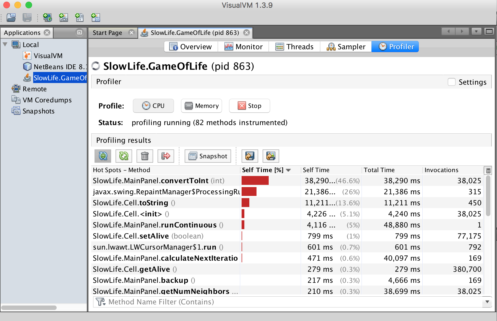

# IS2545 - DELIVERABLE 4: Game of Life

In this assignment, I used VisualVM to find out the hot spots in the game. I made screen shots to record the game?s performance before and after my modification.

It cost the original code 1 minute to reach the final status while 2.36s for the modified code.

In exploratory testing, I found a good start status for placing those cells 

 
which will make the program run relatively long time(so that the method?s performance can be determined easier). Before I click "run continuous", I also checked other buttons to make sure every method was activated.

The final cells' status and position would be like this

From the VisualVM screenshot of the original code's performance, we can see MainPanel.convertToInt()'s self time is 38290ms, Cell.toString()'s self time is 11211ms and MainPanel.runContinuous()'s self time is 4116ms. 

These three mothods are the most unefficient so I decided to modify them.

For MainPanel.convertToInt(), I found it unnecessary because only getNumNeighbors() in MainPanel uses this method, and the "numNeighbors" in getNumNeighbors() is already an Integer, which means convertToInt() is unnecessary. I modified the "return" in getNumNeighbors() and get rid of convertToInt().

In Cell.toString(), is unnecessary to do String combination, we can directly judge whether the cell is alive by calling getAlive(). I remove all the loop and String adding parts in the method. Making judgement directly from getAlive().

Actually in MainPanel.runContinuous(), there exists a unnecessary part to set up a variable called "origR" no other place needs, so I commented it out. Besides, in the backup() method, it defines object cells in every iteration. So I moved its cell definition and initialization parts out of the method to the MainPanel construct method,letting it only executes once.

At last, in the "modified" screenshot, MainPanel.runContinuous()'s total time significantly dropped to 260ms, while other two modifeid target even dissapear from the list, which means the modification works.

Pining tests are in the "Test Packages".

